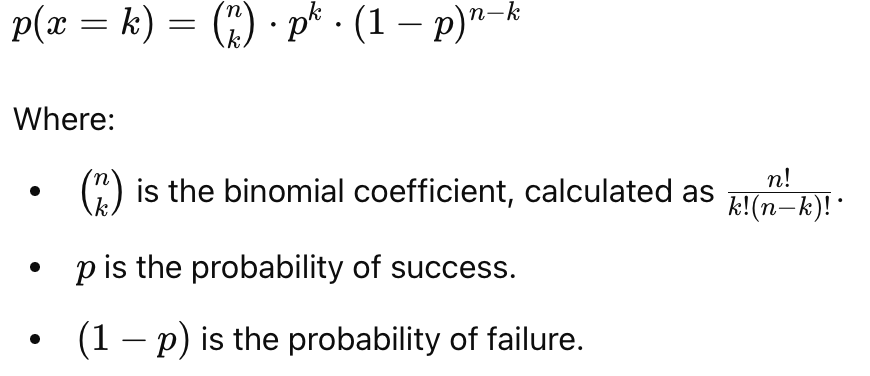

## EMBL-EBI Training Webinars

[A beginner's guide to interpreting results from biostatistics](https://www.ebi.ac.uk/training/events/beginners-guide-interpreting-results-biostatistics/)
### Statistical Models

- **Purpose:** A statistical model represents our view of a process and aims to describe the data-generating process.
- **Function:** It summarizes a set of assumptions and specifies the relationships between variables.
- **Use:** Helps calculate the probability of the data under these assumptions.

### Binomial Model

> "All models are wrong, but some are useful."  
> — George Box

- **Simplification:** The binomial model simplifies reality by neglecting factors like age, region, or other preconditions. Assumed probabilities are subject to uncertainty.
- **Usefulness:** Despite its simplifications, the binomial model can serve as a starting point for further investigation and provides a straightforward estimate of how unusual the data might be.

### Example

When the true prevalence is 4%, the probability of observing 9 or more events out of 100 (or more extreme) is **p=0.02**.

#### Python Code for p-value Calculation

To calculate the p-value for observing \( k = 9 \) events out of 100, you can use the following Python code:

```python
from scipy.stats import binom

n = 100  # Total number of trials or observations
p = 0.04  # True prevalence or probability of success
k = 9  # Number of observed events

# Calculate the p-value
p_value = 1 - binom.cdf(k - 1, n, p)
print(f"The p-value is: {p_value}")
```
It returns 0.01899.

The `binom.cdf` means the cumulative distribution function, the 'k-1' means up to k-1 (or >=k) sucesses.

#### Binomial probability formula to caculate the p value/ probability of observing k=9 events out of 100,

To calculate the p-value or probability of observing \( k = 9 \) events out of 100 using the binomial probability formula:




The p means probability of sucess on a single trail; the 1-p means the probability of failure of a single trail.

Since we are asking about the k=9 or more extreme
the fumula should be:

**p(X>=k)=1-p(X<k) or p(X>=k)=1-p(x<=k-1)**

### Hypothesis test for a single gene from RNA-seq counts

- the nromaolized counts differ in their (log) average between the groups.
- how likely is it to see such a difference just by a chance.

* A statistical model for gene expression, the p-value quantifies evidence against the **null hypothesis**.
* For example, the gene MPO were significantly higher in the cold group relative to the no cold group at day0 (p=0.01).
  This means, under assumptions, that the test meaks and under the assumption that there is no difference between the expression level in the two groups, the probability of seeing the data is p=0.01.

### Other Statistical Values

- **Effect Size**: A measure of the magnitude of the difference or relationship in your data. It helps to quantify the size of the effect, making the results more interpretable beyond just statistical significance.

- **Adjusted p-value**: A p-value that has been modified to account for multiple comparisons or tests. Adjustments help control the false discovery rate and reduce the likelihood of Type I errors (false positives).

- **Mean of Median Values**: The average of the median values across different groups or samples. This can provide a robust central tendency measure, especially in the presence of outliers or non-normal distributions.

- **Power Calculation (Sample Size)**: The probability of correctly rejecting the null hypothesis when it is false. A conventional cut-off for adequate power is greater than 80%, indicating a high likelihood of detecting a true effect if one exists.

- **Conventional Cut-off for p-value**: The threshold below which results are considered statistically significant. The conventional cut-off is usually set at 0.05 (5%), meaning there is a 5% chance of observing the data, or something more extreme, if the null hypothesis is true.


